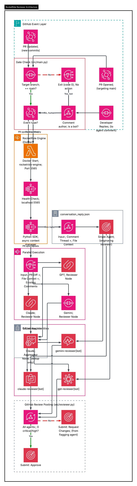

# rocketride-reviewer

Multi-agent AI code review GitHub Action powered by [RocketRide](https://rocketride.org). Three independent AI agents (Claude, GPT, Gemini) review your pull requests in parallel, each posting under its own GitHub App identity.

## Quick Start

```yaml
# .github/workflows/review.yml
name: RocketRide PR Review

on:
  pull_request:
    types: [opened, synchronize]
    branches: [main]
  issue_comment:
    types: [created]

jobs:
  review:
    runs-on: ubuntu-latest
    steps:
      - uses: rocketride-org/rocketride-reviewer@v1
        with:
          openai_api_key: ${{ secrets.OPENAI_API_KEY }}
          anthropic_api_key: ${{ secrets.ANTHROPIC_API_KEY }}
          google_api_key: ${{ secrets.GOOGLE_API_KEY }}
          claude_app_id: ${{ secrets.CLAUDE_APP_ID }}
          claude_app_private_key: ${{ secrets.CLAUDE_APP_PRIVATE_KEY }}
          gpt_app_id: ${{ secrets.GPT_APP_ID }}
          gpt_app_private_key: ${{ secrets.GPT_APP_PRIVATE_KEY }}
          gemini_app_id: ${{ secrets.GEMINI_APP_ID }}
          gemini_app_private_key: ${{ secrets.GEMINI_APP_PRIVATE_KEY }}
```

That's it. Open a PR targeting `main` and all three agents will post reviews within minutes.

---

## How It Works

1. A PR is opened or updated targeting your main branch
2. Three AI reviewers run in parallel via RocketRide's pipeline engine
3. A Claude-based aggregator deduplicates overlapping comments across agents
4. Each agent posts its review under its own GitHub App identity (`claude-reviewer[bot]`, `gpt-reviewer[bot]`, `gemini-reviewer[bot]`)
5. If no critical or high severity issues are found, all three agents auto-approve the PR
6. Reply to any agent's comment and only that agent responds — scoped, conversational follow-up

## Architecture



### Agents

| Agent | Model | Role |
|-------|-------|------|
| `claude-reviewer[bot]` | Claude Sonnet | Independent code reviewer |
| `gpt-reviewer[bot]` | GPT-4o | Independent code reviewer |
| `gemini-reviewer[bot]` | Gemini 2.0 Flash | Independent code reviewer |
| Aggregator | Claude Sonnet | Deduplicates overlapping comments |

### Pipeline Modes

**Full Review** — Triggered on PR open/update. All three agents review the diff in parallel. The aggregator removes duplicate findings (same file, same line range, same intent) before posting.

**Conversation Reply** — Triggered when a developer replies to an agent's comment. Only the originating agent runs, receiving the comment thread and surrounding file context. The other two agents stay silent.

### Approval Logic

| Condition | Result |
|-----------|--------|
| Zero critical/high findings across all agents | All three agents submit **Approve** |
| Any critical/high finding | Flagging agent(s) submit **Request Changes**, others submit **Comment** |

---

## Configuration

Create an optional `.rocketride-review.yml` in your repository root:

```yaml
# Review scope: "full" (include file context) or "diff" (diff only)
review_context: full

# Target branch (default: main)
target_branch: main

# Severity threshold for auto-approval: "critical" or "high"
approval_threshold: high

# Add patterns to the default ignore list
ignore_patterns_extra:
  - "migrations/**"
  - "*.sql"

# Or replace the defaults entirely
# ignore_patterns_override:
#   - "*.lock"
#   - "dist/**"

# Large PR handling
max_chunk_lines: 500      # Max lines per diff chunk
chunk_overlap_lines: 20   # Overlap between segments
max_files: 50             # Skip review above this many changed files
max_total_lines: 5000     # Skip review above this many changed lines
```

### Default Ignored Files

Lock files, minified assets, generated code, build output, images, and fonts are ignored by default. See the [PRD](docs/PRD.md) for the full list.

---

## Required Secrets

You need three LLM API keys and three GitHub App credential pairs (one per reviewer agent):

| Secret | Description |
|--------|-------------|
| `OPENAI_API_KEY` | OpenAI API key for GPT reviewer |
| `ANTHROPIC_API_KEY` | Anthropic API key for Claude reviewer and aggregator |
| `GOOGLE_API_KEY` | Google AI API key for Gemini reviewer |
| `CLAUDE_APP_ID` | GitHub App ID for `claude-reviewer[bot]` |
| `CLAUDE_APP_PRIVATE_KEY` | Private key for `claude-reviewer[bot]` |
| `GPT_APP_ID` | GitHub App ID for `gpt-reviewer[bot]` |
| `GPT_APP_PRIVATE_KEY` | Private key for `gpt-reviewer[bot]` |
| `GEMINI_APP_ID` | GitHub App ID for `gemini-reviewer[bot]` |
| `GEMINI_APP_PRIVATE_KEY` | Private key for `gemini-reviewer[bot]` |

Each GitHub App needs these permissions:
- **Pull requests**: Read & Write
- **Issues**: Read & Write
- **Contents**: Read

See the [Setup Guide](docs/SETUP.md) for step-by-step instructions on creating the GitHub Apps.

---

## Action Inputs

| Input | Required | Default | Description |
|-------|----------|---------|-------------|
| `openai_api_key` | Yes | — | OpenAI API key |
| `anthropic_api_key` | Yes | — | Anthropic API key |
| `google_api_key` | Yes | — | Google AI API key |
| `claude_app_id` | Yes | — | Claude reviewer GitHub App ID |
| `claude_app_private_key` | Yes | — | Claude reviewer GitHub App private key |
| `gpt_app_id` | Yes | — | GPT reviewer GitHub App ID |
| `gpt_app_private_key` | Yes | — | GPT reviewer GitHub App private key |
| `gemini_app_id` | Yes | — | Gemini reviewer GitHub App ID |
| `gemini_app_private_key` | Yes | — | Gemini reviewer GitHub App private key |
| `review_context` | No | `full` | `full` or `diff` |
| `config_path` | No | `.rocketride-review.yml` | Path to config file |

---

## Development

```bash
# Install dependencies
pip install -r requirements-dev.txt

# Run tests
pytest tests/ -v

# Run tests with coverage
pytest tests/ -v --cov=src --cov-report=term-missing

# Lint
ruff check src/ tests/

# Format check
black --check src/ tests/

# Type check
mypy src/
```

### Project Structure

```
src/
├── main.py             # Entry point: event detection, gating, orchestration
├── github_client.py    # GitHub API wrapper (diffs, comments, reviews)
├── engine.py           # RocketRide engine lifecycle (Docker)
├── pipeline.py         # Pipeline execution (full review + conversation)
├── aggregator.py       # Comment deduplication across agents
├── reviewer.py         # Review posting per GitHub App identity
├── chunker.py          # Large PR diff chunking and line remapping
├── config.py           # Configuration and constants
├── models.py           # Pydantic models (ReviewComment, AgentReview, etc.)
├── filters.py          # File ignore pattern matching
└── errors.py           # Exception hierarchy
```

---

## License

[MIT](LICENSE)
